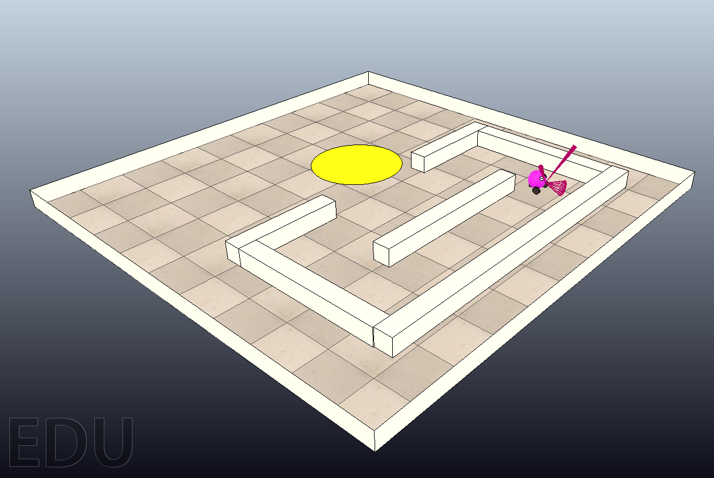

This repository contains a V-REP scence and C++ source code for running a
demonstration of a behavior-based robot controller by a Vector Symbolic
Architecture (read the 
<a href="http://home.wlu.edu/~levys/pubs/aaai2013.pdf">paper</a>). I have
tested the demo on Mac OS X (Mountain Lion 10.8.3) and Linux (64-bit Ubuntu
12.4.0.2). It should not be difficult to
get it to run on Windows as well, but I can't help you with that.  To get
started, download a copy of the V-REP simulator for your system. Look for the
file remoteApiConnections.txt (on OS X it's in vrep.app/Contents/MacOS/; on
Linux it's in the top-level folder, with the vrep.sh script). Un-comment the
three lines in this file that specify the port information. Launch a terminal
window, cd to the the programming directory, and issue the command

<pre>
  make -f remoteApiSharedLib_Makefile Back in the vsarobot folder you created
</pre>

from the zip file, edit the VREP_ROOT variable in the Makefile to reflect where
you installed V-REP. Then change the LOG_FILE variable in bubbleRobClient.cpp
to reflect where you installed the vsarobot folder. Launch a terminal window,
cd to that directory, and issue the make command. This should build the
executable bubbleRobClient.

Launch the V-REP application (by double-clicking the V-REP icon in OS X, or
running the vrep.sh script in Linux), and open the bubbleRob.ttt scene from the
vsarbobot folder. Go to Tools / Scripts and double-click on Child script
(associated with remoteApiControlledBubbleRob). Change the value of the
variable REMOTE_CLIENT to reflect where you built the bubbleRobClient
executable. Go to Simulation / Start Simulation to run the simulation. The
robot should exit the corral and stay in the yellow light disc.

You can switch back and forth between the classical (if/then/else) controller and the VSA controller by editing the ARCH variable at the top of the Makefile. Have fun, and email me with any questions.
